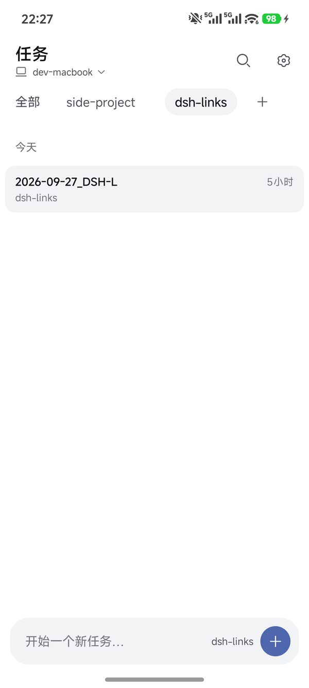
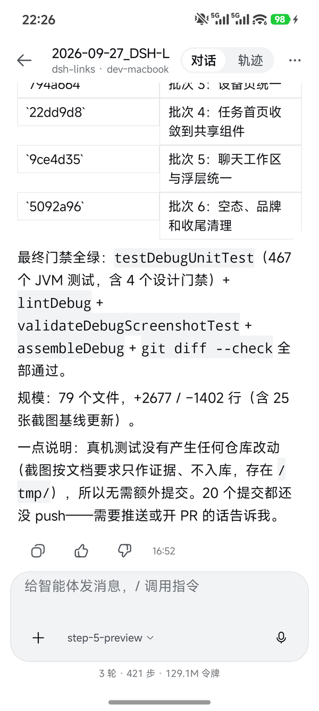
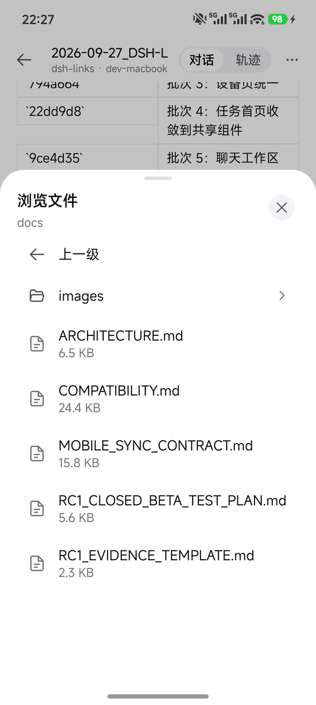
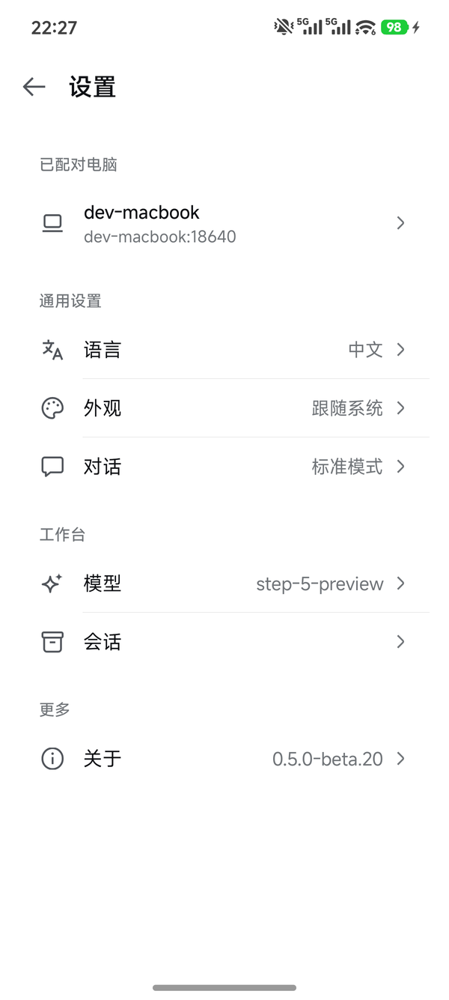
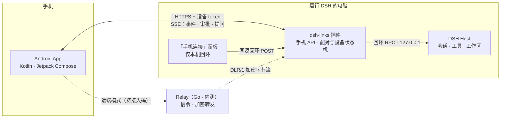

<div align="center">
  
  <h1>DSH Links</h1>
  <p><b>DeepSeek Harness 的手机端</b> · 局域网配对 · 原生 Android 会话工作台</p>

  <p>
    
    
    
    
    
    
  </p>

  <p>
    <a href="https://github.com/lunaship/dsh-links/actions/workflows/ci.yml"></a>
    <a href="https://github.com/lunaship/dsh-links/actions/workflows/ci-android.yml"></a>
    <a href="https://www.npmjs.com/package/dsh-links"></a>
    <a href="https://github.com/lunaship/dsh-links/releases?q=app-v&expanded=true"></a>
  </p>
</div>

<table>
  <tr>
    <td width="25%"></td>
    <td width="25%"></td>
    <td width="25%"></td>
    <td width="25%"></td>
  </tr>
  <tr>
    <td align="center"><sub>任务首页 · 按工作区筛选</sub></td>
    <td align="center"><sub>会话工作台 · Markdown 与工具轨迹</sub></td>
    <td align="center"><sub>浏览工作区文件</sub></td>
    <td align="center"><sub>设置</sub></td>
  </tr>
</table>

<p align="center"><sub>真机截图于 2026-09-27（HyperOS，<code>0.5.0-beta.20</code> 源码 debug 构建）。主机名与非本仓库的工作区名已替换为示例值。</sub></p>

---

> [!IMPORTANT]
> **本项目为独立的社区项目。** DSH Links 与 DeepSeek 无隶属、授权或背书关系；DeepSeek Harness 的名称与相关标识归各自所有者。问题请在本仓库反馈，不要提交给上游。
>
> **项目处于公开 Beta。** 正式支持范围是**可信局域网**；远端 Relay 为邀请制内测。插件、App 与同步协议迭代较快，升级前请看 [`CHANGELOG.md`](CHANGELOG.md) 与 [兼容矩阵](docs/COMPATIBILITY.md)。

---

## 概览

**DSH Links** 让运行在电脑、家中主机或远程服务器上的 DeepSeek Harness 拥有一个经过配对的原生手机入口。电脑继续运行 DSH、工具与工作区；手机负责看会话、发消息、收实时事件、处理审批与提问。

它不是远程桌面，也不是把 DSH Web 塞进手机浏览器：一个仓库、三个发布物、一条配对信任链。

| 发布物 | 位置 | 作用 | 分发 |
|---|---|---|---|
| **DSH 插件** `dsh-links` | [`src/`](src/) | 手机 HTTPS 接入代理、配对与设备状态机、电脑端「手机连接」面板 | npm（`beta` dist-tag） |
| **Android App** | [`apps/android/`](apps/android/) | 扫码配对、原生会话工作台、实时流、审批与提问 | 签名 APK，见 [Releases](https://github.com/lunaship/dsh-links/releases?q=app-v&expanded=true)（`app-v*`） |
| **Relay** | [`relay/`](relay/) | 跨网络配对的信令与加密转发（DLR/1） | 源码公开；使用需维护者接入码 |

---

## 设计原则

- **信任方向只有两条。** 手机 → 插件（持配对签发的设备 token，走 HTTPS）；插件 → Host（仅本机回环 RPC）。手机永远不直达 Host。跨设备吊销、全部吊销、工作区批准这类高危操作只存在于回环面板，手机 API 刻意不提供。
- **原生，而不是套壳。** 工作台是 Jetpack Compose：Material 3 负责结构、导航、状态与无障碍，色值与节奏以 DSH Web 为唯一参照（[视觉合同](apps/android/docs/visual-rules.md)）。
- **门禁即验收。** 设计 token、间距刻度、色源、文件与函数体量都有单测门禁，预算只降不升；UI 改动随 PR 提交截图基线。
- **冒烟必须隔离。** 任何联调都用独立 `stateDir`，不碰真实配对——这条规则来自一次真实事故，写在 [`CLAUDE.md`](CLAUDE.md) 的红线里。

---

## 功能

### 配对与信任

- **扫码或 6 位配对码**：电脑端「手机连接」面板生成二维码与配对码，一次性、可防重放；同名设备走显式替换流程。
- **证书固定**：首次配对即固定电脑端自签 TLS 证书指纹，之后每次连接逐位校验；App 禁用明文 HTTP。
- **凭据只在 Keystore**：设备 token 与证书指纹以不可导出的 Android Keystore 密钥加密保存，禁用云备份；卸载即失效。
- **审批式工作区注册**：手机只能提交已存在目录的真实路径，由电脑端面板批准后才创建。

### 原生会话工作台

- **流式渲染**：SSE 实时推送，新到字符逐段淡入，不整屏闪烁；断线 30 秒内自动重连并按游标续传，缺口时整页重同步。
- **完整的 Markdown**：代码高亮、表格、KaTeX 数学公式、Mermaid 图（均随 APK 离线打包，经锁死的 WebView 渲染）。
- **思考与工具轨迹**：推理过程可折叠，工具调用与结果成组展示；对话 / 轨迹视图切换，支持工具查找、轮次跳转与子代理视图。
- **输入**：模型与推理强度选择、图片附件、系统分享到 App、语音输入、命令面板（`/plan`、`/goal` 等）。
- **自适应布局**：手机单栏；平板与折叠屏展开时改用侧边导航栏，改动审查面在宽屏贴右展开。
- **中英双语**：界面文案随系统或手动切换。

### 审批与提问

- **审批卡**：允许一次 / 拒绝，带工具名与参数；重连宽限期内的请求不会丢失，提交幂等。
- **澄清问题**：多题、单选 / 多选 / 自由输入，服务端校验答案。
- **请求快照**：重连后以服务端请求状态为准，已在电脑端处理的请求在手机上同步为终态。

### 改动与文件

- **本轮改动**：每轮结束附改动卡（文件数、增删行），点开进入审查面——文件列表与逐块对比，宽屏贴右展开。
- **词级高亮**：删除行与新增行按顺序配对后，标出行内真正变化的片段；整行重写不标，避免满屏噪音。
- **工作区文件浏览**：在会话菜单「浏览文件」按层进入会话工作目录，图片与文本就地预览，未知后缀按内容嗅探。沙箱与越界检查与文件下载接口一致。
- **本轮产出**：代理写入的文件以卡片列出，点按预览或复制路径。

### 本地优先

- **会话秒开**：打开会话先显示上次的本地快照，网络结果回来后整体接管。快照以独立 Keystore 密钥加密、按主机隔离，未结束的审批在快照里只显示「状态待确认」，不可提交。
- **草稿不丢**：输入框正文按主机落盘，进程被系统回收后回到同一会话仍在；发送途中被杀的消息会停在本地，回来后回填而不是自动重发。

---

## 架构



一条请求的生命线、目录契约与两条关键设计线（审批式工作区注册、SSE 续传）见 [`docs/ARCHITECTURE.md`](docs/ARCHITECTURE.md)；手机 API 的字段级契约见 [`docs/MOBILE_SYNC_CONTRACT.md`](docs/MOBILE_SYNC_CONTRACT.md)。

---

## 目录结构

```text
dsh-links/
├── src/                          # DSH 插件（npm 包唯一发布内容）
│   ├── index.js                  # 入口：路由注册、配对 / 设备状态机、Runtime 装配
│   ├── mobile-api.js             # 手机 HTTPS API 唯一实现（/dsh-link/mobile/*）
│   ├── module2.js                # 「手机连接」面板源码（client.js 由 build-client.mjs 生成）
│   ├── workspace-*.js            # 工作区注册、改动转发、文件与目录沙箱
│   └── relay/                    # Relay 客户端协议（DLR/1）
├── relay/                        # Relay 服务端（Go），独立部署
├── apps/android/                 # Android App（Android Studio 打开这里）
│   ├── app/src/main/java/dev/deeplinks/
│   │   ├── core/                 # 跨屏契约：主题 / 排版 / 颜色 token、本地化、加密、布局推导
│   │   ├── native/               # 工作台屏幕与 Compose 组件
│   │   └── devices/              # 配对、扫码与设备管理
│   ├── app/src/test/             # JVM 单测与架构门禁（token / 间距 / 色源 / 体量预算）
│   ├── app/src/screenshotTest/   # Compose 截图测试；基准图在 screenshotTestDebug/reference
│   └── docs/                     # 视觉合同与 UI 贡献规则
├── test/                         # 插件 node:test 套件
├── scripts/                      # DLR/1 向量对拍、架构冒烟、内测证据收集
└── docs/                         # 架构、同步契约、兼容矩阵、内测计划
```

---

## 快速开始

1. **在运行 DSH 的电脑上安装插件**，并启动 DSH Web：

   ```bash
   dsh plugin --profile web add dsh-links@<version>   # 当前 beta 版本见上方 npm 徽章
   dsh web
   ```

2. **配对**：打开 DSH Web 设置 →「手机连接」，用 App 扫描二维码，或手动输入配对码。

   

3. **开始使用**：在 App 里选择已配对的电脑，进入会话工作台。

> [!NOTE]
> 局域网配对不需要接入码。远端访问的可选路径（Tailscale、Cloudflare Tunnel、DSH Links Relay）见 [`REMOTE_ACCESS.md`](REMOTE_ACCESS.md)。**不要**把 `18640` 端口直接做路由器端口转发。

---

## 开发与构建

### 环境要求

- **Node.js** `>= 20`，**pnpm**（插件依赖锁定在 `pnpm-lock.yaml`）
- **JDK 17 与 Android SDK**（`minSdk 26`、`targetSdk 36`；AGP 9.3、Kotlin 2.4）
- **Go** `1.25`（仅 Relay）
- 一台运行 DeepSeek Harness 的电脑；当前基线见 [兼容矩阵](docs/COMPATIBILITY.md)

### 插件

```bash
pnpm install
npm run prepack        # 生成面板 client.js + 全量测试
npm test               # 仅跑 node:test 套件
```

开发期可直接挂本地目录：`dsh plugin --profile web add /path/to/dsh-links`。改完源码需**重启 host** 才生效。

> [!WARNING]
> 插件 state 默认全局共享（`~/.dsh/dsh-links/state.json`，不分 profile）。任何冒烟或联调都必须通过 `stateDir` 配置隔离，且不得调用吊销类操作——否则会吊销你真实手机的配对。

### Android App

```bash
cd apps/android
./gradlew :app:assembleDebug :app:testDebugUnitTest :app:lintDebug
./gradlew :app:validateDebugScreenshotTest     # 截图基线校验
./gradlew :app:updateDebugScreenshotTest       # 改 UI 后更新基线，逐张人工审图后随 PR 提交
```

debug 变体的包名带 `.debug` 后缀，与签名 release 共存、互不覆盖；真机设备测试一律走 debug 变体（完整命令见 [`apps/android/README.md`](apps/android/README.md)）。

### Relay

```bash
cd relay
gofmt -l . && go vet ./... && go build ./...
```

### 质量门禁

CI 分三路：插件跑 DLR/1 向量对拍、面板生成物一致性、`node:test`、打包清单与依赖审计；Relay 跑 race 测试、vet 与协议 fuzz；App 跑向量对拍、JVM 单测 + lint、截图校验与 debug 构建。App 单测里包含一组**架构门禁**：

| 门禁 | 守住什么 |
|---|---|
| `DesignTokenUsageTest` / `ComponentLanguageTest` | 颜色、圆角、字号只能来自 token，组件语法统一 |
| `DshPaletteProvenanceTest` | 主题色取自 DSH 调色板镜像，偏离必须写明原因 |
| `DshSpacingUsageTest` | 间距走 `DshSpace` 刻度，刻度外存量只降不升 |
| `CodeHygieneTest` | 文件与函数体量预算，只降不升 |
| 截图测试 | 设计系统、对话流、审批 / 提问卡、改动面板的亮 / 暗、中 / 英、大字号基线 |

### 发布

插件在发布 GitHub Release（`v<version>`）时由 [`publish-npm.yml`](.github/workflows/publish-npm.yml) 经 npm Trusted Publishing 发布，预发布版本进入对应 dist-tag。App 只发本机签名的 APK，附在 `app-v*` Release 上。完整核对清单见 [`RELEASING.md`](RELEASING.md)。

---

## 安全与隐私

- 配对 token、TLS 证书指纹与会话本地快照均以 Android Keystore 密钥加密保存，禁用云备份；敏感界面启用 `FLAG_SECURE`。
- App 只走 TLS；渲染不可信内容的 WebView 禁止文件与 content URL 访问；release 构建剥离并脱敏日志。
- Relay 只实时转发 App 与已配对电脑之间的加密字节流，不持久化聊天正文、Prompt、文件、工作区内容、审批内容或响应正文。
- Relay 的控制面会保留设备、路由、凭证生命周期、撤销状态、在线心跳、聚合流量统计与必要的审计元数据——这些不是会话内容。因此准确的表述是「Relay 不存储业务内容，仅保存最小控制元数据」。
- 云端二维码内含 Relay 路由凭据，与接入码同等敏感，请勿截图分享；issue、截图与 PR 中不要张贴接入码。

完整说明见 [`PRIVACY.md`](PRIVACY.md) 与 [`SECURITY.md`](SECURITY.md)。

### 官方 APK 签名证书

```text
CN=DSH Links, OU=lunaship, O=lunaship, C=CN
SHA-256: 38f71adf8b67d81042c99a3ec0dfdafb4303dd31e3fc491068ccd534cb482a47
```

安装前可用 `apksigner verify --print-certs <apk>` 核对。

---

## License

DSH Links 以 [MIT](LICENSE) 许可发布。

「DSH Links」名称、logo 与应用图标**不在** MIT 授权范围内；第三方 fork 请更换名称、图标与 `applicationId` 后再分发。随包的第三方库与资源保留各自许可，见 [`THIRD_PARTY_NOTICES.md`](THIRD_PARTY_NOTICES.md) 与 [`apps/android/THIRD_PARTY_NOTICES.md`](apps/android/THIRD_PARTY_NOTICES.md)。

---

## 致谢

- **[DeepSeek Harness](https://github.com/deepseek-ai)**：本项目服务的对象；插件运行在它的 cordis 插件体系之上。
- **[Lody iOS](https://github.com/Innei/lody-ios)**：本地快照秒开、词级 diff、工作区文件树与离线截图验收的思路，以及这份自述的结构，都受它启发。
- **[KaTeX](https://github.com/KaTeX/KaTeX)** 与 **[Mermaid](https://github.com/mermaid-js/mermaid)**：离线打包的数学公式与图表渲染。
- **[OkHttp](https://square.github.io/okhttp/)**、**[Coil](https://github.com/coil-kt/coil)**、**[ZXing Android Embedded](https://github.com/journeyapps/zxing-android-embedded)**：网络、图片与扫码。
- **[Plus Jakarta Sans](https://github.com/tokotype/PlusJakartaSans)**：界面字体。
- **[node-qrcode](https://github.com/soldair/node-qrcode)** 与 **[selfsigned](https://github.com/jfromaniello/selfsigned)**：配对二维码与自签 TLS 证书。
