<div align="center">
  <picture>
    <source media="(prefers-color-scheme: dark)" srcset="docs/images/brand/cetus-horizontal-white-transparent.svg" />
    
  </picture>
  <p><b>DeepSeek Harness 的手机端</b> · 任务收件箱 · 局域网配对 · 原生 Android 与 iOS 工作台</p>

  <p>
    
    
    
    
    
    
    
    
    
  </p>

  <p>
    <a href="https://github.com/lunaship/dsh-cetus/actions/workflows/ci.yml"></a>
    <a href="https://github.com/lunaship/dsh-cetus/actions/workflows/ci-android.yml"></a>
    <a href="https://github.com/lunaship/dsh-cetus/actions/workflows/ci-ios.yml"></a>
    <a href="https://github.com/lunaship/dsh-cetus/actions/workflows/ci-push.yml"></a>
    <a href="https://github.com/lunaship/dsh-cetus/releases?q=app-v&expanded=true"></a>
  </p>
</div>

<p align="center"><sub><b>Android</b>：以下都是 App 的真实渲染（Compose 截图测试基线，<code>apps/android/app/src/screenshotTestDebug/reference/</code>），示例数据为虚构。
截图基线由 <code>.github/workflows/regen-screenshots.yml</code> 自动生成，已覆盖浅色 / 深色、中文 / 英文、普通 / 大字号。</sub></p>

<table>
  <tr>
    <td width="25%">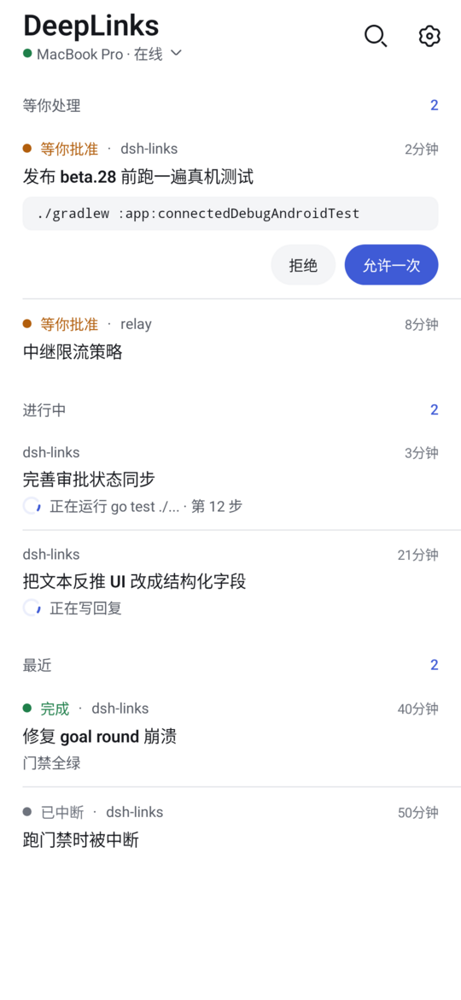</td>
    <td width="25%">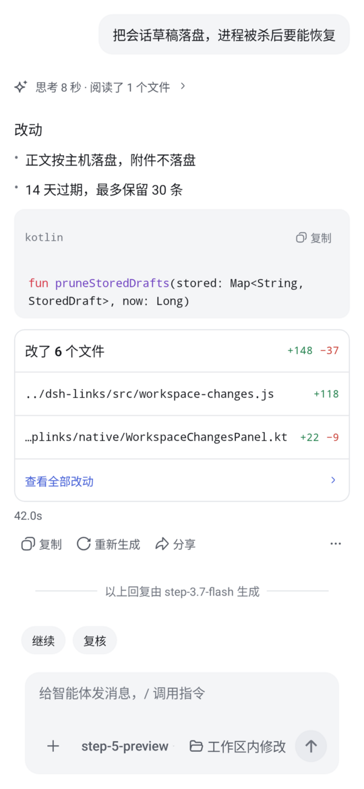</td>
    <td width="25%">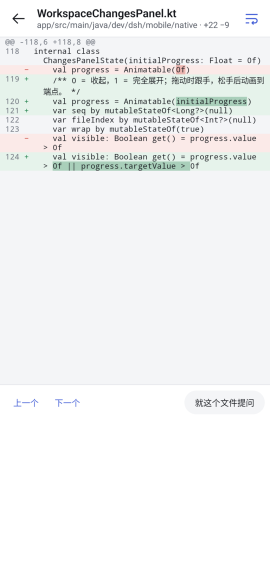</td>
    <td width="25%">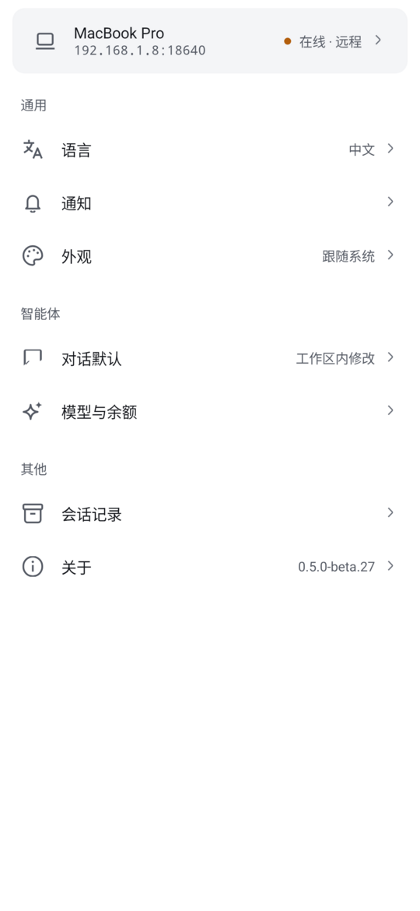</td>
  </tr>
  <tr>
    <td align="center"><sub>首页 · 等你处理 / 进行中 / 最近</sub></td>
    <td align="center"><sub>对话 · 正文、改动卡与输入区</sub></td>
    <td align="center"><sub>看改动 · 文件差异</sub></td>
    <td align="center"><sub>设置</sub></td>
  </tr>
</table>

<details>
  <summary>查看全部 15 个页面与状态</summary>

  <table>
    <tr>
      <td><br /><sub>01 · 首页 · 等你处理 / 进行中 / 最近</sub></td>
      <td><br /><sub>02 · 对话 · 正文、改动卡与输入区</sub></td>
      <td>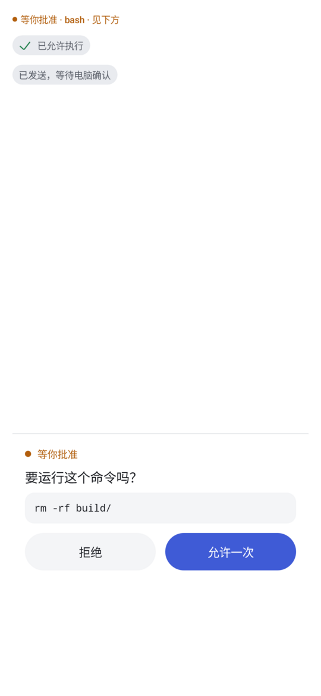<br /><sub>03 · 审批 · 决策栏替换输入区</sub></td>
    </tr>
    <tr>
      <td><br /><sub>04 · 看改动 · 文件差异</sub></td>
      <td><br /><sub>05 · 设置</sub></td>
      <td>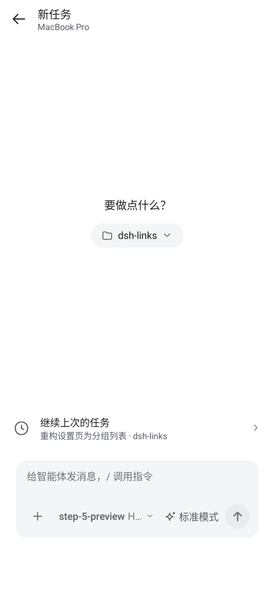<br /><sub>06 · 新任务</sub></td>
    </tr>
    <tr>
      <td>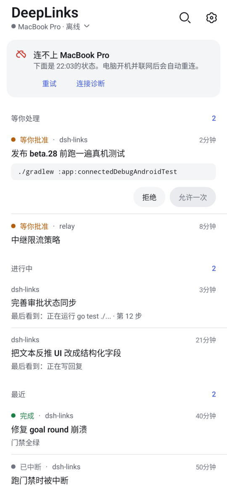<br /><sub>07 · 电脑离线</sub></td>
      <td>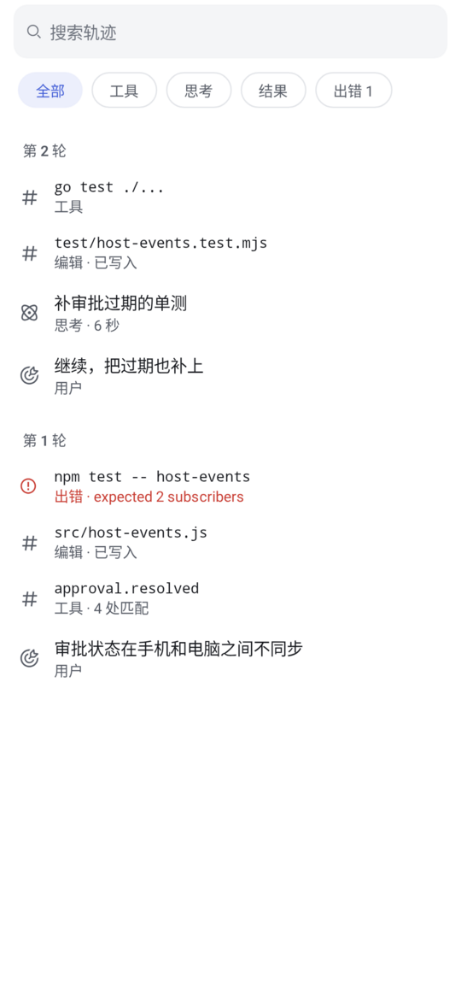<br /><sub>08 · 轨迹</sub></td>
      <td>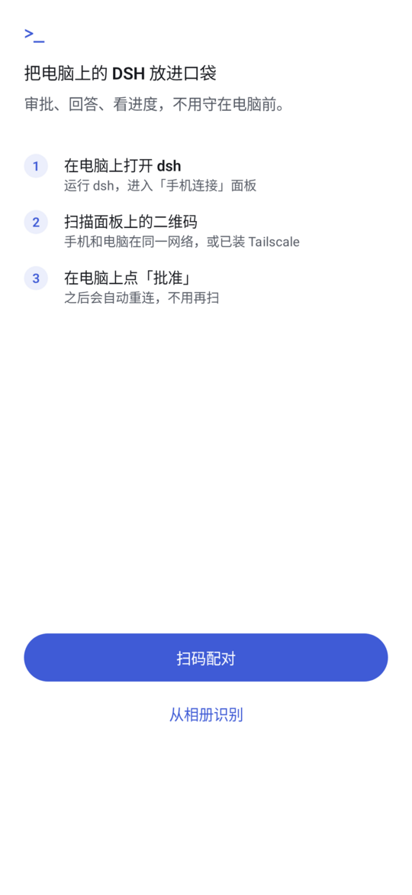<br /><sub>09 · 欢迎 / 扫码配对</sub></td>
    </tr>
    <tr>
      <td>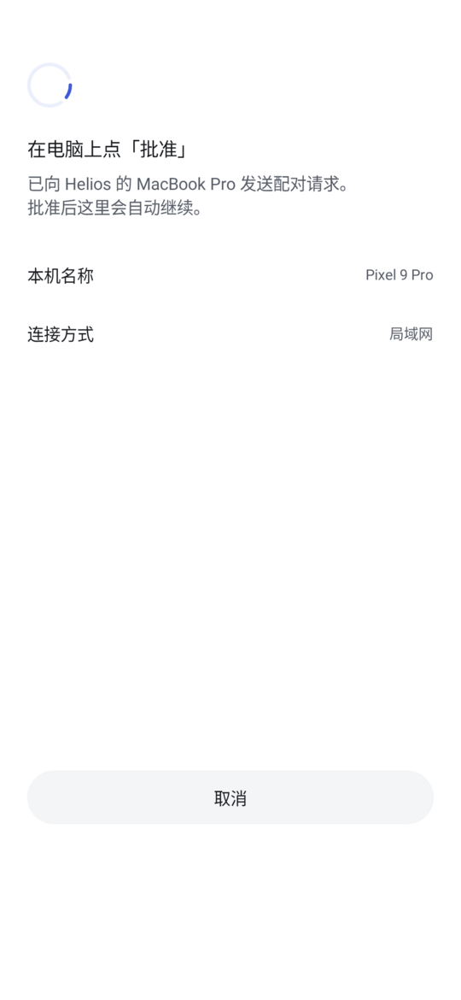<br /><sub>10 · 等电脑批准</sub></td>
      <td>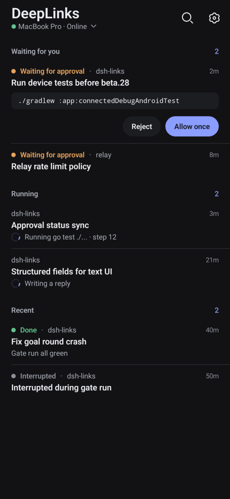<br /><sub>11 · 首页 · 深色 / 英文</sub></td>
      <td>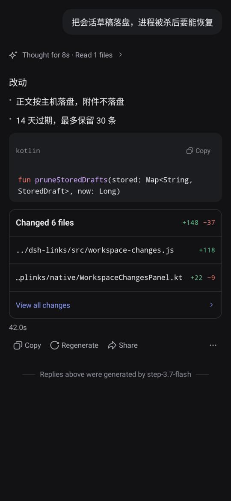<br /><sub>12 · 对话 · 深色 / 英文</sub></td>
    </tr>
    <tr>
      <td>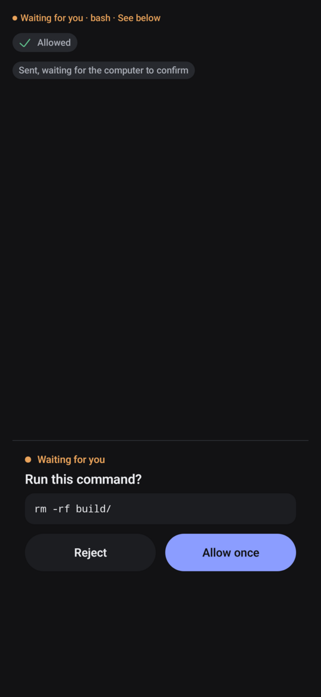<br /><sub>13 · 审批 · 深色 / 英文</sub></td>
      <td>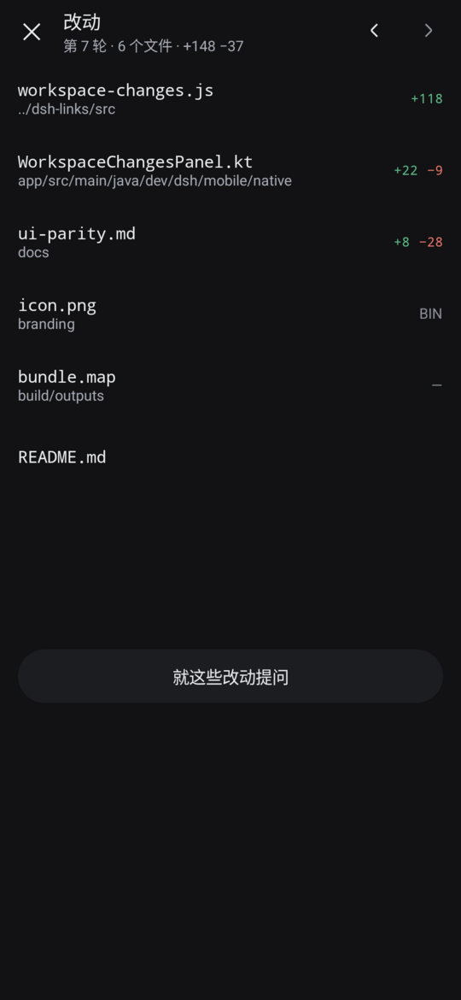<br /><sub>14 · 改动列表 · 深色</sub></td>
      <td>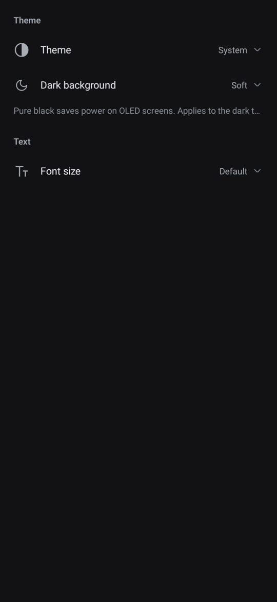<br /><sub>15 · 外观设置 · 深色 / 英文</sub></td>
    </tr>
  </table>
</details>

<p align="center"><sub><b>iOS</b>：同样是 App 的真实渲染（SwiftUI 截图测试基线，<code>apps/ios/Tests/__Snapshots__/</code>），示例数据为虚构。
基线只由 <code>.github/workflows/ios-regen-screenshots.yml</code> 在 CI 上重录，不在本地生成；命名约定 <code>Snapshot_&lt;页面号&gt;_&lt;场景&gt;_&lt;light|dark&gt;_&lt;zh|en&gt;.&lt;variant&gt;.png</code>，主页面覆盖浅 / 深 × 中 / 英 × 默认 / 大字号（accessibility3）。</sub></p>

<table>
  <tr>
    <td width="25%">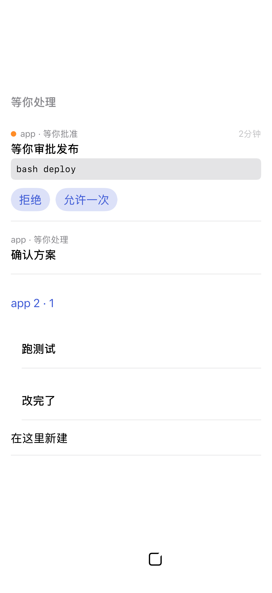</td>
    <td width="25%">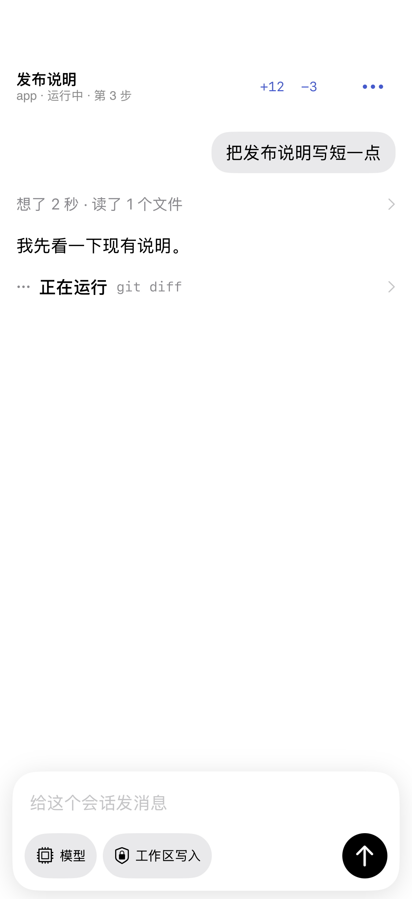</td>
    <td width="25%">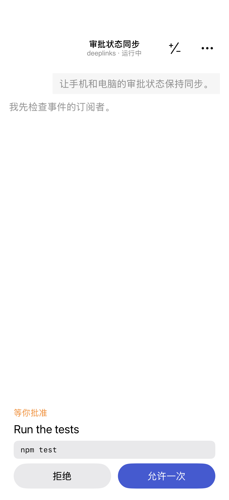</td>
    <td width="25%">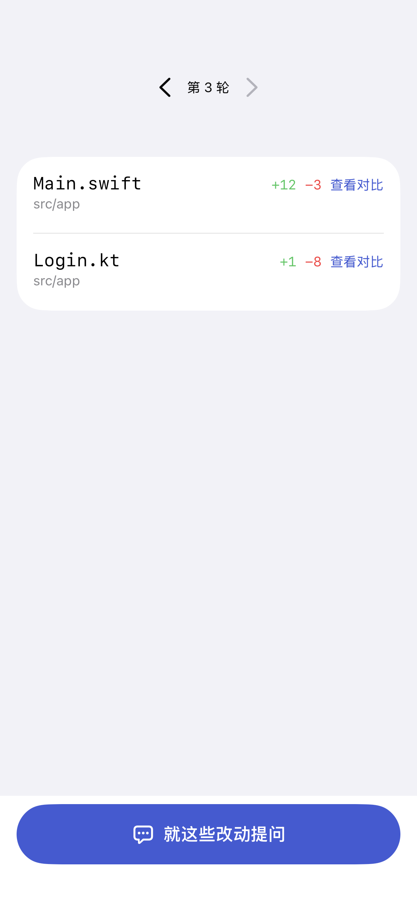</td>
  </tr>
  <tr>
    <td align="center"><sub>首页 · 等你处理</sub></td>
    <td align="center"><sub>对话 · 运行中</sub></td>
    <td align="center"><sub>审批 · 决策栏替换输入区</sub></td>
    <td align="center"><sub>看改动 · 本轮改动列表</sub></td>
  </tr>
</table>

<details>
  <summary>查看 iOS 深色 / 英文基线</summary>

  <table>
    <tr>
      <td>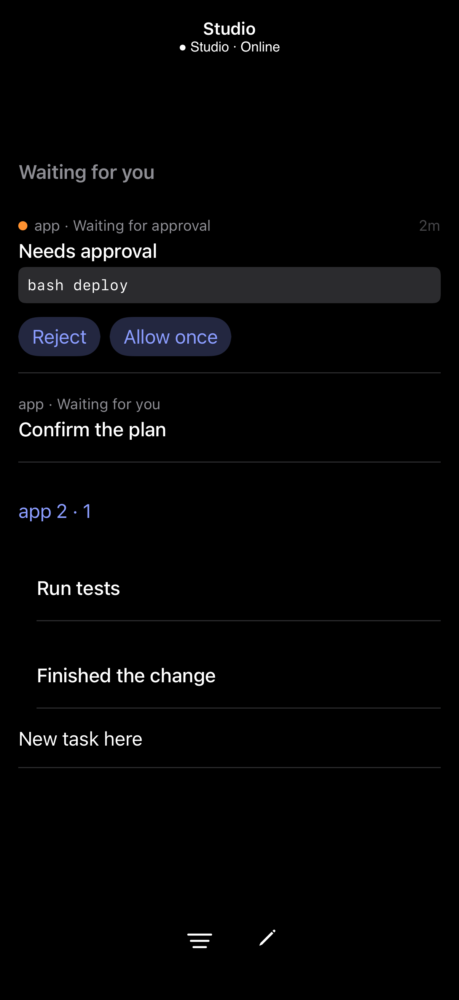<br /><sub>首页 · 深色 / 英文</sub></td>
      <td>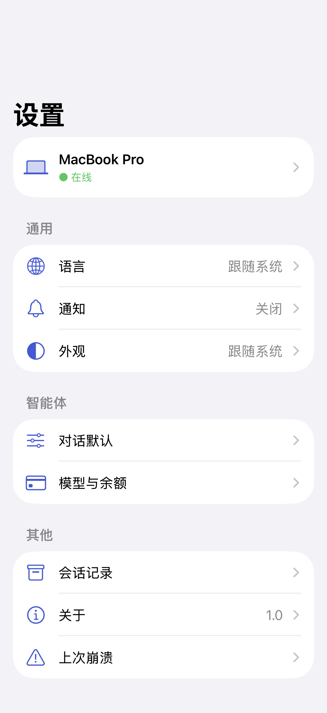<br /><sub>设置 · 浅色 / 中文</sub></td>
      <td>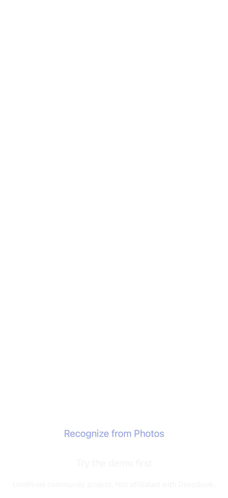<br /><sub>欢迎 / 扫码配对 · 深色 / 英文</sub></td>
    </tr>
  </table>
</details>

---

> [!IMPORTANT]
> **本项目为独立的社区项目。** Cetus 与 DeepSeek 无隶属、授权或背书关系；DeepSeek Harness 的名称与相关标识归各自所有者。问题请在本仓库反馈，不要提交给上游。
>
> **项目处于公开 Beta。** 正式支持范围是**可信局域网**。出门优先用 Tailscale（零服务器、直连）；中继（DLP/1）是免配置备选，仍为实验性功能。插件、App 与同步协议迭代较快，升级前请看 [`CHANGELOG.md`](CHANGELOG.md) 与 [兼容矩阵](docs/COMPATIBILITY.md)。

## 远程连接

电脑和手机在同一个 Tailscale 网络里时，配对二维码会自动带上 Tailscale 地址。手机先试局域网主地址，不通再试这条直连，都失败才走中继。不需要自己填 `100.x` 地址，也不用另开一台服务器。中继是没装 Tailscale 时的免配置备选。细节见 [`REMOTE_ACCESS.md`](REMOTE_ACCESS.md)。

---

## 推送网关（DLPUSH/1）

iOS 的后台不给常驻 SSE，手机离开 App 后就没有连接；推送网关补上这一段。它由用户电脑上的插件把**端到端加密**的通知密文交给一个开源、无状态的网关，网关只把密文转给 APNs——**看不到通知内容**，也没有任何路径向电脑下命令。批准与回复仍走局域网 / Tailscale / DLP/1 中继。

- **默认关闭。** 手机端设置 7.4「通知」的总开关默认关；开启前有说明页写明内容端到端加密、网关看不到。
- **端到端加密。** 通知内容用设备独有的 32 字节内容密钥 `K`（AES-256-GCM）在插件侧加密，`K` 只存在手机 Keychain 与插件 state 里；网关拿不到，也伪造不出可被通知扩展解密的通知。
- **网关看不到 APNs token。** 手机的 device token 用 HPKE（X25519 / HKDF-SHA256 / ChaCha20-Poly1305）封装后才交给网关，插件同样打不开。
- **无状态。** 网关没有数据库，不存用户数据、不提供注册库、不向电脑下发任何命令；日志只记计数、HTTP 状态、耗时与限流命中，不记密文、token 与明文。
- **锁屏不泄内容。** 通知栏只提供「打开」，没有批准按钮；解密失败或不新鲜时退回「Cetus 有新的任务动态」。

逐字节协议合同（`POST /v1/push`、`GET /v1/keys`、`GET /healthz`、密钥与字段定义、错误码与红线）见 [`docs/rfc/0002-push-gateway.md`](docs/rfc/0002-push-gateway.md)；网关实现（Go，`cmd/dlpush`）在 [`push/`](push/)，可与官方网关互换自建。

## 概览

**Cetus** 让运行在电脑、家中主机或远程服务器上的 DeepSeek Harness 拥有一个经过配对的原生手机入口。电脑继续运行 DSH、工具与工作区；手机负责看会话、发消息、收实时事件、处理审批与提问。

它不是远程桌面，也不是把 DSH Web 塞进手机浏览器：一个仓库、四个发布物、一条配对信任链。

| 发布物 | 位置 | 作用 | 分发 |
|---|---|---|---|
| **DSH 插件** `dsh-cetus` | [`src/`](src/) | 手机 HTTPS 接入代理、配对与设备状态机、电脑端「手机连接」面板 | 本仓 git 源（`github:lunaship/dsh-cetus`，固定版本见 [Releases](https://github.com/lunaship/dsh-cetus/releases)） |
| **Android App** | [`apps/android/`](apps/android/) | 扫码配对、原生会话工作台、实时流、审批与提问 | 签名 APK，见 [Releases](https://github.com/lunaship/dsh-cetus/releases?q=app-v&expanded=true)（`app-v*`） |
| **iOS App** | [`apps/ios/`](apps/ios/) | 同上的原生 iOS 客户端（SwiftUI，iOS 26+），另含通知扩展与 Live Activity | 源码公开；需自行用 Xcode 签名构建，官方构建待发布 |
| **Relay** | [`relay/`](relay/) | 远程连接的哑管道中继（DLP/1，`cmd/dlp-relay`），只拼接两条 WSS | 源码公开；可用官方中继或自建，无需接入码 |
| **Push Gateway** | [`push/`](push/) | 无状态推送网关（DLPUSH/1，`cmd/dlpush`），只把端到端加密的通知密文转给 APNs | 源码公开；官方网关或自建，默认关闭 |

---

## 设计原则

- **信任方向只有两条。** 手机 → 插件（持配对签发的设备 token，走 HTTPS）；插件 → Host（仅本机回环 RPC）。手机永远不直达 Host。跨设备吊销、全部吊销、工作区批准这类高危操作只存在于回环面板，手机 API 刻意不提供。
- **原生，而不是套壳。** 工作台是 Jetpack Compose：Material 3 负责结构、导航、状态与无障碍，色值与节奏以 DSH Web 为唯一参照（[视觉合同](apps/android/docs/visual-rules.md)）。
- **门禁即验收。** 设计 token、间距刻度、色源、文件与函数体量都有单测门禁，预算只降不升；UI 改动随 PR 提交截图基线。
- **冒烟必须隔离。** 任何联调都用独立 `stateDir`，不碰真实配对——这条规则来自一次真实事故，写在 [`AGENTS.md`](AGENTS.md) 的红线里。

## 功能

### 配对与信任

- **扫码或 6 位配对码**：电脑端「手机连接」面板生成二维码与配对码，一次性、可防重放；同名设备走显式替换流程。
- **证书固定**：首次配对即固定电脑端自签 TLS 证书指纹，之后每次连接逐位校验；App 禁用明文 HTTP。
- **凭据只在 Keystore**：设备 token 与证书指纹以不可导出的 Android Keystore 密钥加密保存，禁用云备份；卸载即失效。
- **审批式工作区注册**：手机只能提交已存在目录的真实路径，由电脑端面板批准后才创建。

### 原生会话工作台

- **流式渲染**：SSE 实时推送，新到字符逐段淡入，不整屏闪烁；断线 30 秒内自动重连并按游标续传，缺口时整页重同步。
- **完整的 Markdown**：代码高亮、表格、KaTeX 数学公式、Mermaid 图（均随 APK 离线打包，经锁死的 WebView 渲染）。
- **思考与工具轨迹**：推理过程可折叠，工具调用与结果成组展示；对话 / 轨迹视图切换，支持工具查找、轮次跳转与子代理视图。
- **会话控制**：排队消息可编辑 / 撤回 / 插队；目标可编辑、暂停、继续、清除；「⋯」菜单查看与修改定时任务（需插件声明 `capabilities.control`）。
- **实底界面**：顶栏、输入区与弹层都是实色（v4 设计，不用毛玻璃与渐隐）；审批 / 提问由输入区位置的决策栏承接，状态槽一次只显示一条。
- **长回复不卡**：长 Markdown 分段懒加载，流式增量按帧合并。
- **输入**：模型与推理强度选择、图片附件、系统分享到 App（先选新任务或最近会话，只预填不发送）、语音输入、命令面板（`/plan`、`/goal` 等）。
- **自适应布局**：手机单栏；平板与折叠屏展开时改用侧边导航栏，改动审查面在宽屏贴右展开。
- **中英双语**：界面文案随系统或手动切换，切换后立即生效（截图基线同时守着中 / 英两轨）。

### 任务收件箱与新任务

- **任务集中处理**：首页按「等你处理 / 进行中 / 最近」分组，显示电脑在线状态、工作区筛选和任务摘要；电脑离线时保留最近状态并提供重连入口。
- **手机接管审批**：仅在手机正在接管对应会话时展示可操作审批卡；其他待处理事项明确提示在电脑上处理。
- **新任务草稿态**：点「+ 新任务」进入对话页草稿态——「继续上次的任务」、工作区胶囊（行尾常驻「更多」打开
  选择器）与智能体预设贴底陈列，直接复用对话页输入栏发送；系统分享进来的文本与图片也落在草稿态输入框。
  旧的底部面板已删除。

### 审批与提问

- **审批卡**：允许一次 / 拒绝，两个按钮同等视觉权重；手机收到的请求不含完整参数，对话内与首页审批卡都有说明，锁屏通知不显示工具名；重连宽限期内的请求不会丢失，提交幂等。
- **澄清问题**：多题、单选 / 多选 / 自由输入，服务端校验答案。
- **请求快照**：重连后以服务端请求状态为准，已在电脑端处理的请求在手机上同步为终态。

### 改动与文件

- **本轮改动**：每轮结束附改动卡（文件数、增删行），点开进入审查面——文件列表与逐块对比，宽屏贴右展开。
- **词级高亮**：删除行与新增行按顺序配对后，标出行内真正变化的片段；整行重写不标，避免满屏噪音。
- **下载校验**：文件响应带 SHA-256，App 校验不一致即丢弃。
- **工作区文件浏览**：在会话菜单「浏览文件」按层进入会话工作目录，图片与文本就地预览，未知后缀按内容嗅探。沙箱与越界检查与文件下载接口一致。
- **本轮产出**：代理写入的文件以卡片列出，点按预览或复制路径。

### 本地优先

- **会话秒开**：打开会话先显示上次的本地快照，网络结果回来后整体接管。快照以独立 Keystore 密钥加密、按主机隔离，未结束的审批在快照里只显示「状态待确认」，不可提交。
- **草稿不丢**：输入框正文按主机落盘，进程被系统回收后回到同一会话仍在；发送途中被杀的消息会停在本地，回来后回填而不是自动重发。

---

## 架构

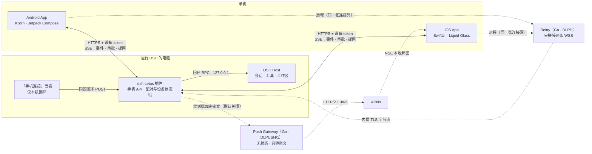
```mermaid
flowchart LR
    subgraph Phone ["手机"]
        AppA["Android App<br/>Kotlin · Jetpack Compose"]
        AppI["iOS App<br/>SwiftUI · Liquid Glass"]
    end

    subgraph Computer ["运行 DSH 的电脑"]
        direction TB
        Plugin["dsh-cetus 插件<br/>手机 API · 配对与设备状态机"]
        Panel["「手机连接」面板<br/>仅本机回环"]
        Host["DSH Host<br/>会话 · 工具 · 工作区"]
    end

    Relay["Relay（Go · DLP/1）<br/>只拼接两条 WSS"]
    Push["Push Gateway（Go · DLPUSH/1）<br/>无状态 · 只转密文"]
    APNs["APNs"]

    AppA <-->|"HTTPS + 设备 token<br/>SSE：事件 · 审批 · 提问"| Plugin
    AppI <-->|"HTTPS + 设备 token<br/>SSE：事件 · 审批 · 提问"| Plugin
    Panel -->|"同源回环 POST"| Plugin
    Plugin -->|"回环 RPC · 127.0.0.1"| Host
    AppA -.->|"远程（同一张连接码）"| Relay
    AppI -.->|"远程（同一张连接码）"| Relay
    Relay -.->|"内层 TLS 字节流"| Plugin
    Plugin -.->|"端到端加密密文（默认关闭）"| Push
    Push -.->|"HTTP/2 + JWT"| APNs
    APNs -.->|"NSE 本地解密"| AppI
```

一条请求的生命线、目录契约与两条关键设计线（审批式工作区注册、SSE 续传）见 [`docs/ARCHITECTURE.md`](docs/ARCHITECTURE.md)；手机 API 的字段级契约见 [`docs/MOBILE_SYNC_CONTRACT.md`](docs/MOBILE_SYNC_CONTRACT.md)。

---

## 目录结构

```text
dsh-cetus/
├── src/                          # DSH 插件
│   ├── index.js                  # 入口：路由注册、配对 / 设备状态机、Runtime 装配
│   ├── mobile-api.js             # 手机 HTTPS API 唯一实现（/dsh-link/mobile/*）
│   ├── panel.js                  # 「手机连接」面板源码（client.js 由 build-client.mjs 生成）
│   ├── workspace-*.js            # 工作区注册、改动转发、文件与目录沙箱
│   └── remote/                   # 远程连接：Agent、运行时、state（DLP/1）
├── relay/                        # DLP/1 中继服务端（Go，dlp-relay），独立部署
├── push/                         # DLPUSH/1 推送网关（Go，dlpush），无状态、只转密文
├── apps/ios/                     # iOS App（XcodeGen：xcodegen generate 后用 Xcode 打开）
│   ├── App/                      # SwiftUI 界面（Features 按页面分目录）
│   ├── Packages/                 # DLModels / DLCore / DLSecurity / DLNet / DLRemote / DLUI
│   ├── Extensions/               # NotificationService（NSE 解密）、LiveActivity、Share
│   ├── Tests/__Snapshots__/      # SwiftUI 截图测试基线（只由 CI 重录）
│   └── docs/                     # 页面对照表与 iOS 视觉规则
├── apps/android/                 # Android App（Android Studio 打开这里）
│   ├── app/src/main/java/dev/deeplinks/
│   │   ├── core/                 # 跨屏契约：主题 / 排版 / 颜色 token、本地化、加密、布局推导
│   │   │   └── remote/           # DLP/1：自动选路、隧道 socket、远程路由
│   │   ├── native/               # 工作台屏幕与 Compose 组件
│   │   └── devices/              # 配对、扫码与设备管理
│   ├── app/src/test/             # JVM 单测与架构门禁（token / 间距 / 色源 / 体量预算）
│   ├── app/src/screenshotTest/   # Compose 截图测试；基准图在 screenshotTestDebug/reference
│   └── docs/                     # 视觉合同与 UI 贡献规则
├── test/                         # 插件 node:test 套件
├── scripts/                      # 真中继端到端、架构冒烟、内测证据收集
├── testdata/dlp1/                # DLP/1 三端共用测试向量（JS / Go / Kotlin）
├── testdata/push/                # DLPUSH/1 加密测试向量（hpke / content）
└── docs/                         # 架构、同步契约、兼容矩阵、RFC、内测计划
```

---

## 快速开始

1. **在运行 DSH 的电脑上安装插件**，并启动 DSH Web：

   ```bash
   dsh plugin --profile web add github:lunaship/dsh-cetus
   dsh web
   ```

   上面装的是 `main`（当前 Beta 源）。要固定版本，在地址后加 [Releases](https://github.com/lunaship/dsh-cetus/releases) 里的插件 tag，例如 `#v0.1.0-beta.18`；插件与 App 的配套关系见 [兼容矩阵](docs/COMPATIBILITY.md)。

2. **配对**：打开 DSH Web 设置 →「手机连接」，用 App「扫描二维码」或「从相册识别」（选择一张含连接二维码的截图）完成配对。

   

3. **开始使用**：在 App 里选择已配对的电脑，进入会话工作台。

> [!NOTE]
> 配对不需要账号。远程访问（内置远程连接、Tailscale、Cloudflare Tunnel）见 [`REMOTE_ACCESS.md`](REMOTE_ACCESS.md)。**不要**把 `18640` 端口直接做路由器端口转发。

---

## 开发与构建

### 环境要求

- **Node.js** `>= 20`，**pnpm**（插件依赖锁定在 `pnpm-lock.yaml`）
- **JDK 17 与 Android SDK**（`minSdk 26`、`targetSdk 36`；AGP 9.3、Kotlin 2.4）
- **Go** `1.25`（仅中继与推送网关，两个模块各自独立）
- **Xcode / iOS 26 SDK + XcodeGen**（仅 iOS，`brew install xcodegen`）
- 一台运行 DeepSeek Harness 的电脑；当前基线见 [兼容矩阵](docs/COMPATIBILITY.md)

### 插件

```bash
pnpm install
npm run prepack        # 生成面板 client.js + 全量测试
npm test               # 仅跑 node:test 套件
```

开发期可直接挂本地目录：`dsh plugin --profile web add /path/to/dsh-cetus`。改完源码需**重启 host** 才生效。

> [!WARNING]
> 插件 state 默认全局共享（`~/.dsh/dsh-cetus/state.json`，不分 profile）。旧的 `~/.dsh/dsh-links/` 会在升级后**自动迁移**，且源目录**原样保留为备份 / 回滚点**，无需手动处理。任何冒烟或联调都必须通过 `stateDir` 配置隔离，且不得调用吊销类操作——否则会吊销你真实手机的配对。

### Android App

```bash
cd apps/android
./gradlew :app:assembleDebug :app:testDebugUnitTest :app:lintDebug
./gradlew :app:validateDebugScreenshotTest     # 截图基线校验
./gradlew :app:updateDebugScreenshotTest       # 改 UI 后更新基线，逐张人工审图后随 PR 提交
```

debug 变体的包名带 `.debug` 后缀，与签名 release 共存、互不覆盖；真机设备测试一律走 debug 变体（完整命令见 [`apps/android/README.md`](apps/android/README.md)）。

### iOS App

```bash
cd apps/ios
# 先生成构建元数据（project.yml 用 configFiles 引用，缺文件会让 xcodegen 报错）
node ../../scripts/build-metadata.mjs --platform ios
xcodegen generate        # project.yml → Cetus.xcodeproj（.xcodeproj 不入库）
xcodebuild -scheme Cetus -destination 'platform=iOS Simulator,name=iPhone 17 Pro' build
xcodebuild -scheme Cetus -destination 'platform=iOS Simulator,name=iPhone 17 Pro' test
```

截图基线**只允许**由 `.github/workflows/ios-regen-screenshots.yml` 在 CI 上重录，禁止提交本地基线；改 UI 后先触发该 workflow，再把新基线随 PR 提交。约束与目录契约见 [`apps/ios/AGENTS.md`](apps/ios/AGENTS.md)，页面对照见 [`apps/ios/docs/page-mapping.md`](apps/ios/docs/page-mapping.md)。

### 中继

```bash
cd relay
gofmt -l . && go vet ./... && go build ./... && go test ./... -race
```

自建部署见 [`relay/README.md`](relay/README.md)。

### 推送网关

```bash
cd push
gofmt -l . && go vet ./... && go build ./... && go test ./... -race   # 门禁，CI 见 ci-push.yml
```

网关配置走环境变量：`DLPUSH_LISTEN`（默认 `:8080`）、`DLPUSH_HPKE_KEYS`、`APNS_KEY_P8_PATH`（0600，不进 git）、`APNS_KEY_ID`、`APNS_TEAM_ID`、`APNS_BUNDLE_ID`、`DLPUSH_RATE_MINUTE`（默认 10）、`DLPUSH_RATE_HOUR`（默认 120）、`DLPUSH_VERSION`。协议与红线见 [`docs/rfc/0002-push-gateway.md`](docs/rfc/0002-push-gateway.md)。

### 质量门禁

CI 分四路：插件跑面板生成物一致性、`node:test`、打包清单与依赖审计；中继跑 race 测试、vet 与控制帧 fuzz；推送网关跑 `gofmt` / `go vet` / race 测试与模糊测试；Android App 跑 JVM 单测（含 DLP/1 三端共用向量）+ lint、截图校验与 debug / release 构建，模拟器 job 真正执行设备测试（冷启动冒烟 + 公式 / Mermaid 渲染链路 + TokenCrypto 并发首生），release 的 R8 mapping 上传为制品用于崩溃反混淆。iOS 由 `ci-ios.yml` 在 macOS runner 上跑本地化目录检查、构建、单测与截图校验，另有真机端到端（`ios-e2e.yml`）与性能（`ios-performance.yml`）工作流。Android App 单测里包含一组**架构门禁**：

| 门禁 | 守住什么 |
|---|---|
| `DesignTokenUsageTest` / `ComponentLanguageTest` | 颜色、圆角、字号只能来自 token，组件语法统一 |
| `DshPaletteProvenanceTest` | 主题色取自 DSH 调色板镜像，偏离必须写明原因 |
| `DshSpacingUsageTest` | 间距走 `DshSpace` 刻度，刻度外存量只降不升 |
| `CodeHygieneTest` | 文件与函数体量预算，只降不升 |
| 截图测试 | 设计系统、对话流、审批 / 提问卡、改动面板的亮 / 暗、中 / 英、大字号基线 |

### 发布

插件不发布到 npm registry：直接以本仓 git 源安装/更新。Android App 只发本机签名的 APK，附在 `app-v*` Release 上；iOS App 目前以源码分发，官方构建待发布。完整核对清单见 [`RELEASING.md`](RELEASING.md)。

---

## 安全与隐私

- 配对 token、TLS 证书指纹与会话本地快照均以 Android Keystore 密钥加密保存，禁用云备份；敏感界面启用 `FLAG_SECURE`。iOS 侧同类凭据（设备 token、证书指纹、端到端推送密钥 `K`）只存 Keychain，`kSecAttrAccessibleAfterFirstUnlockThisDeviceOnly` 且 `kSecAttrSynchronizable = false`（不进 iCloud 钥匙串）。
- 对话中的网络图片默认不自动加载（防止提示注入借图片外传内容、暴露 IP），点按单张才加载且仅限 HTTPS；设置「隐私」分组可改为自动加载。
- App 只走 TLS；渲染不可信内容的 WebView 禁止文件与 content URL 访问、禁止联网并加 CSP（只放行随包打包的 KaTeX / Mermaid）；release 构建剥离并脱敏日志。
- 中继（DLP/1）只拼接手机与电脑各自向外建立的 WebSocket，转发的是内层 TLS 加密字节流；它不保存账号、设备档案或任何业务内容，只在内存里保留在线路由、活跃流与聚合流量计数。
- 推送网关（DLPUSH/1）默认关闭，无数据库、无用户档案；它只见到端到端加密的密文与 HPKE 封装的 APNs token，看不到通知内容，也没有任何路径向电脑下发命令。
- 电脑只在验证过手机的会合密钥之后才连本机端口；业务授权仍是设备 Token，吊销设备立即断开它的远程连接。
- 手机连接码在有效期内可以添加新设备（远程首配仍需电脑上批准），请勿截图外传。

完整说明见 [`PRIVACY.md`](PRIVACY.md) 与 [`SECURITY.md`](SECURITY.md)。

### 官方 APK 签名证书

```text
CN=DSH Links, OU=lunaship, O=lunaship, C=CN
SHA-256: 38f71adf8b67d81042c99a3ec0dfdafb4303dd31e3fc491068ccd534cb482a47
```

签名证书仍使用旧名称；校验已发布 APK 时请以 SHA-256 指纹为准。

安装前可用 `apksigner verify --print-certs <apk>` 核对。

---

## License

Cetus 以 [MIT](LICENSE) 许可发布。

「Cetus」名称、logo 与应用图标**不在** MIT 授权范围内；第三方 fork 请更换名称、图标与 `applicationId` 后再分发。随包的第三方库与资源保留各自许可，见 [`THIRD_PARTY_NOTICES.md`](THIRD_PARTY_NOTICES.md) 与 [`apps/android/THIRD_PARTY_NOTICES.md`](apps/android/THIRD_PARTY_NOTICES.md)。

---

## 致谢

- **[DeepSeek Harness](https://github.com/deepseek-ai)**：本项目服务的对象；插件运行在它的 cordis 插件体系之上。
- **[Lody iOS](https://github.com/Innei/lody-ios)**：本地快照秒开、词级 diff、工作区文件树与离线截图验收的思路，以及这份自述的结构，都受它启发。
- **[KaTeX](https://github.com/KaTeX/KaTeX)** 与 **[Mermaid](https://github.com/mermaid-js/mermaid)**：离线打包的数学公式与图表渲染。
- **[swift-snapshot-testing](https://github.com/pointfreeco/swift-snapshot-testing)**：iOS 截图测试基线。
- **[XcodeGen](https://github.com/yonaskolb/XcodeGen)**：iOS 工程由 `project.yml` 生成，`.xcodeproj` 不入库。
- **[OkHttp](https://square.github.io/okhttp/)**、**[Coil](https://github.com/coil-kt/coil)**、**[ZXing Android Embedded](https://github.com/journeyapps/zxing-android-embedded)**：网络、图片与扫码。
- **[Plus Jakarta Sans](https://github.com/tokotype/PlusJakartaSans)**：界面字体。
- **[node-qrcode](https://github.com/soldair/node-qrcode)** 与 **[selfsigned](https://github.com/jfromaniello/selfsigned)**：配对二维码与自签 TLS 证书。
